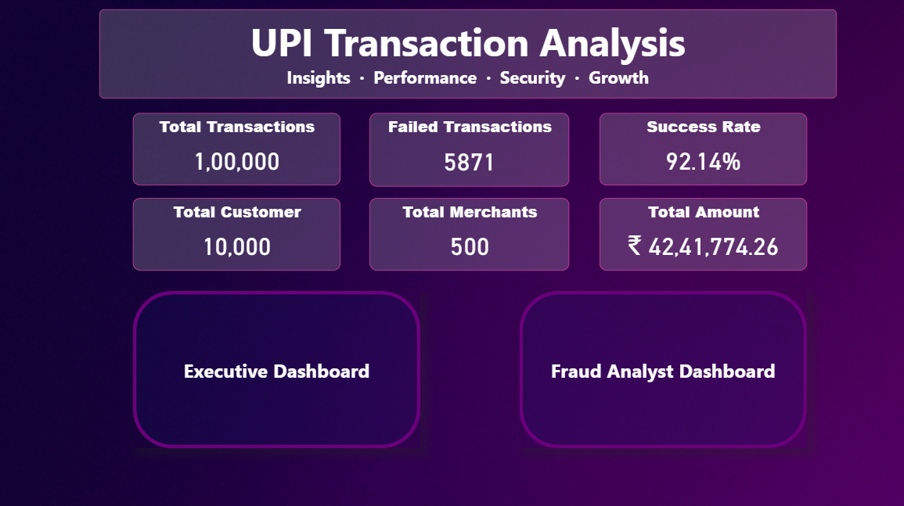
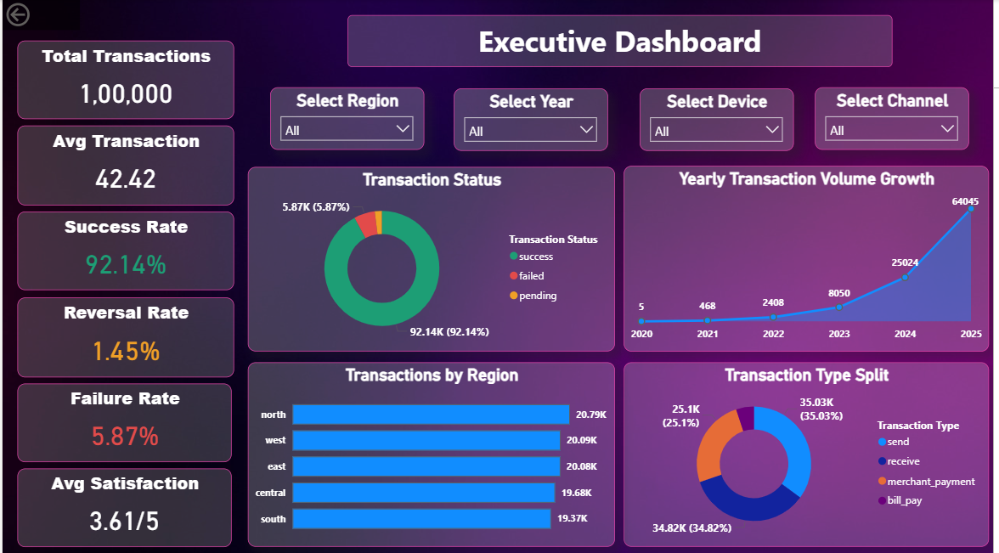
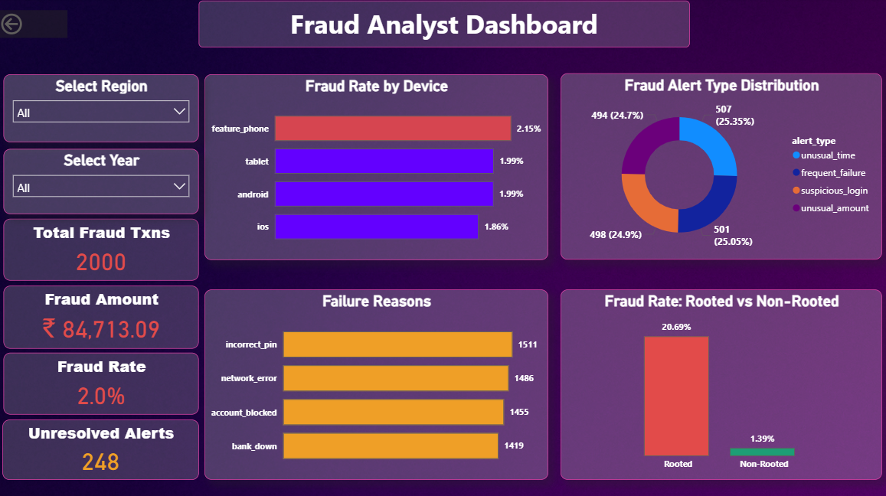
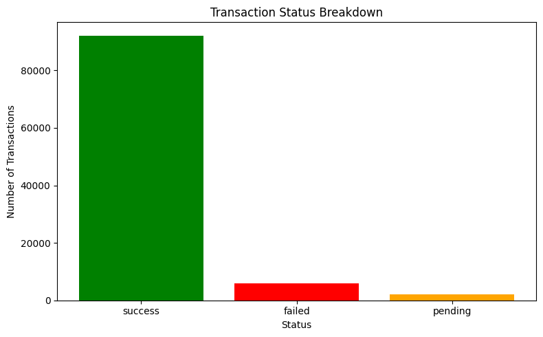
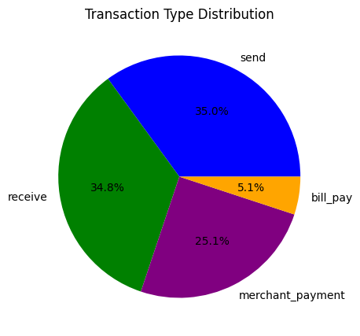
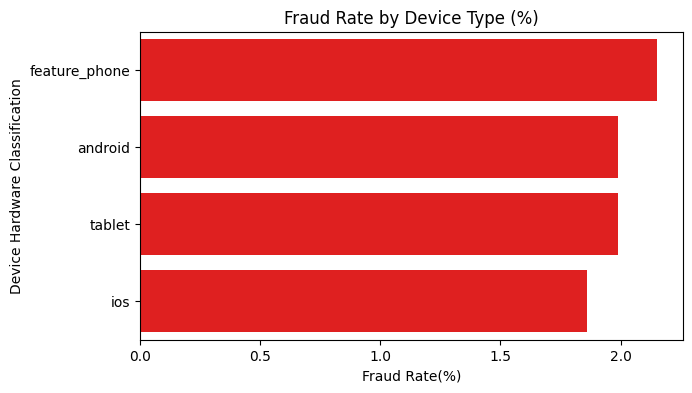
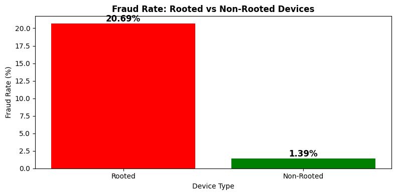
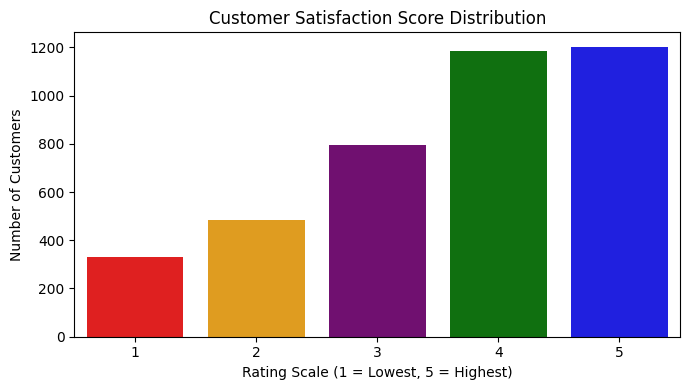

# UPI-Transaction-Risk-Analysis

# UPI Transaction Risk and Performance Analysis

### What Is This Project About?
Every day millions of UPI payments happen across India. Most succeed instantly. Some fail. A small number turn out to be fraud. This project goes through 1,00,000 transactions across 7 connected datasets to find out exactly where the risk is hiding, why payments fail, and which customers and merchants need the most attention.

This was my Data Analytics Capstone Project, built using Python, Power BI, and Excel together.

---

## Tools Used

- Excel: checked data types, missing values, and validated all 7 tables for consistency. Built a Data Quality Log.
- Python (Pandas, Matplotlib, Seaborn, SciPy): full exploratory analysis, 5 charts, and 5 statistical tests
- Power BI: 3-page interactive dashboard with filters for region, year, device, and channel
- PowerPoint: final presentation summarising findings and recommendations

---

## About the Data

| Dataset | Rows | What It Contains |
| :--- | :--- | :--- |
| upi_transaction_history | 1,00,000 | Every transaction with amount, status, device, channel |
| customer_master | 10,000 | Customer details, region, risk score |
| fraud_alert_history | 2,000 | Every fraud alert raised and its resolution status |
| device_info | 12,000 | Device type and rooted status linked to customers |
| merchant_info | 500 | Merchant details and individual risk score |
| upi_account_details | 12,000 | Linked bank account information |
| customer_feedback_surveys | 4,000 | Customer satisfaction scores and complaint categories |

---

## Key Numbers

| What We Found | Number |
|---|---|
| Total transactions analysed | 1,00,000 |
| Success rate | 92.14% |
| Failed transactions | 5,871 |
| Fraud flagged transactions | 2,000 (2%) |
| Fraud rate, rooted devices | 20.69% |
| Fraud rate, non-rooted devices | 1.39% |
| Statistical proof, rooted vs non-rooted | Z = 76.39, p < 0.0001 |
| Overall fraud rate vs 1% baseline | Z = 22.59, p < 0.0001 |
| Unresolved fraud alerts | 248 out of 2,000 |
| Average customer satisfaction | 3.61 out of 5 |
| Top failure reason | Incorrect PIN (1,511 cases) |
| High-risk merchants flagged | 22 out of 500 (risk_score above 0.4) |
| Critical-priority merchants | 9 out of 500 (risk_score above 0.45) |

---

## Dashboard and Chart Preview

### Power BI Dashboard

#### Home Page


#### Executive Dashboard


#### Fraud Analyst Dashboard


### Python EDA Charts

#### Transaction Status Breakdown


#### Transaction Type Distribution


#### Fraud Rate by Device Type


#### Fraud Rate: Rooted vs Non-Rooted Devices


#### Customer Satisfaction Score Distribution


---

## What Does the Data Tell Us?

1. Rooted devices are the single biggest fraud signal. Fraud rate on rooted devices is 20.69% compared to just 1.39% on normal devices. A Z-test confirms this difference is statistically real, not random chance.

2. The platform's overall fraud rate of 2% is significantly above the 1% industry baseline, confirmed with a One-Proportion Z-test (Z = 22.59, p < 0.0001).

3. Most failures are not technical, they are human. The top failure reason is incorrect PIN entry, ahead of network errors and bank downtime.

4. Fraud has no link to channel or region. Chi-square testing showed fraud is evenly spread across payment channels and across all five regions. The real risk factor is entirely device-based.

5. A small group of merchants carry most of the risk. Just 22 out of 500 merchants cross the risk_score threshold of 0.4, making them easy to monitor individually. Note: this 0.4 threshold is an independently chosen business cutoff, separate from the statistical 75th percentile (Q3) used earlier for transaction amount anomaly detection.

6. Customers complain about transactions more than fraud. Transaction issues were the top complaint category in customer feedback.

---

## Recommendations

1. Add extra OTP verification for any transaction above 500 rupees coming from a rooted device.
2. Set a 48-hour SLA for resolving fraud alerts. Right now 248 alerts have no clear resolution timeline.
3. Show a PIN reminder popup after 2 consecutive failed payment attempts to reduce the top failure reason.
4. Set up weekly manual review for the 22 merchants above the 0.4 risk threshold, starting with the 9 highest-priority ones above 0.45.

---

## Project Structure

```
UPI-Transaction-Risk-Analysis/
|
|-- Datasets/
|   |-- customer_master.csv
|   |-- upi_transaction_history.csv
|   |-- fraud_alert_history.csv
|   |-- device_info.csv
|   |-- merchant_info.csv
|   |-- upi_account_details.csv
|   |-- customer_feedback_surveys.csv
|
|-- python_Notebook/
|   |-- python_notebook.ipynb
|
|-- PowerBI/
|   |-- UPI_Risk_Monitoring_Report.pbix
|
|-- Excel/
|   |-- UPI_data_report.xlsx
|
|-- Presentation/
|   |-- upi_ppt.pptx
|
|-- Images/
|   |-- PBI_Home_Page.png
|   |-- PBI_Executive_Dashboard.png
|   |-- PBI_Fraud_Dashboard.png
|   |-- PY_Transaction_Status_Breakdown.png
|   |-- PY_Transaction_Type_Distribution.png
|   |-- PY_Fraud_by_Device.png
|   |-- PY_Rooted_vs_NonRooted.png
|   |-- PY_Customer_Satisfaction_Score.png
|
|-- README.md
```
